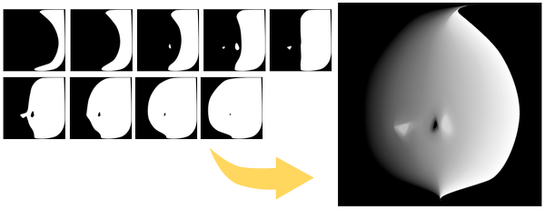

Create a **Shadow Threshold Map** by interpolating SDF (Signed Distance Field).



The algorithm is based on the following link:  
🔗[SDF Based Transition Blending for Shadow Threshold Map - ながむしメモ](https://nagakagachi.hatenablog.com/entry/2024/03/02/140704)  

> **Tested with**
> - Windows 10
> - Python 3.10.9
> - numpy 2.0.0
> - opencv-python 4.10.0.84

## Getting Started
```
python -m venv venv
venv\scripts\activate
pip install numpy opencv-python
```

**Basic :**  
Specify a directory containing only image files with the `-i` option. The images in the directory will be processed in ascending order.  
```powershell
python run.py -i 'sample/sample1'
```

**with Options :**  
You can also run it with some additional options.  
```powershell
python run.py -i 'sample/sample2' -o 'output2' -n 'face_map' -b 16 -r true -t true
```

## Options
- `-i`, `--inputdir` (str) : Input directory path. Default is 'input'.
- `-o`, `--outputdir` (str) : Output directory path. Default is 'output'.
- `-n`, `--outputname` (str) : Output file name. Default is 'shadow_threshold_map'.
- `-b`, `--bitdepth` (int) : Output PNG bit depth (8 or 16). Default is 8.
- `-r`, `--reverse` (bool) : Reverse the gradient direction. Default is false.
- `-t`, `--savetemp` (bool) : Save the image during processing. Default is false.

### `--bitdepth`
16-bit images have smoother shadow boundaries than 8-bit images. However, be aware that the file size and load will be higher.

### `--reverse`
Reverses the gradient direction.

### `--savetemp`
Saves the intermediate images created during processing in `outputdir\temp`. This is for debugging purposes.  

- step 1 : SDF image obtained from the input image
- step 2 : Mask created from the pair of input images
- step 3 : Gradient obtained from the pair of SDF images
- step 4 : LERP with the gradient and masked image

## Reference Links
- [SDF Based Transition Blending for Shadow Threshold Map - ながむしメモ](https://nagakagachi.hatenablog.com/entry/2024/03/02/140704)
- [UE5 SDF Face Shadowマッピングでアニメ顔用の影を作ろう - Let's Enjoy Unreal Engine](https://unrealengine.hatenablog.com/entry/2024/02/28/222220)
- [Get \*PERFECT\* Anime Face Shadows (Easier Way) in Blender - YouTube](https://www.youtube.com/watch?v=x-K6bCAl6Qs)
- [GDC Vault - 3D Toon Rendering in 'Hi-Fi RUSH'](https://gdcvault.com/play/1034330/3D-Toon-Rendering-in-Hi)