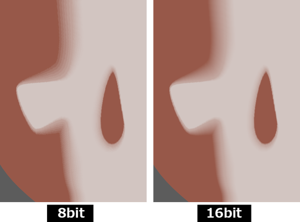
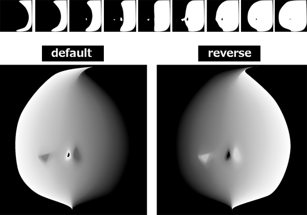
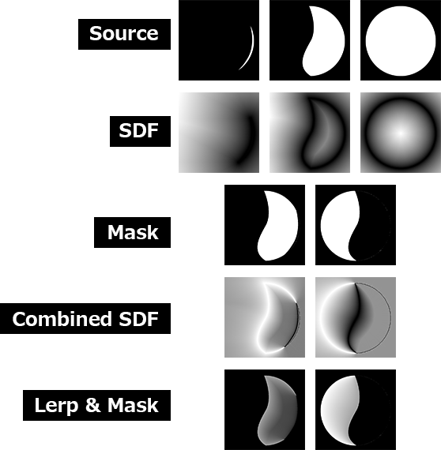

Create a **Shadow Threshold Map** by interpolating SDF (Signed Distance Field).


The algorithm is based on the following link:  
🔗[SDF Based Transition Blending for Shadow Threshold Map - ながむしメモ](https://nagakagachi.hatenablog.com/entry/2024/03/02/140704)  

> **Tested with**
> - Windows 11
> - Python 3.10.9
> - numpy 2.0.0
> - opencv-python 4.10.0.84

## Getting Started
If you use the exe from [Releases](https://github.com/akasaki1211/sdf_shadow_threshold_map/releases), you do not need this step. For more details, see [here](#using-exe).
```
python -m venv venv
venv\scripts\activate
pip install numpy opencv-python
```

**Basic :**  
Specify a directory containing only image files with the `-i` option. The images in the directory will be processed in ascending order.  
```powershell
python run.py -i 'sample/sample1'
```

**with Options :**  
You can also run it with some additional options.  
```powershell
python run.py -i 'sample/sample2' -o 'output2' -n 'face_map' -b 16 -c "rgb" -r -t
```

## Options
- `-i`, `--inputdir` : Specify the input directory path where contains only images. This is a required option.
- `-o`, `--outputdir` : Specify the output directory path where images will be saved. Default is 'output'.
- `-n`, `--outputname` : Specify the base name for the output PNG file. Default is 'shadow_threshold_map'.
- `-b`, `--bitdepth` : Set the bit depth for output PNG files. Valid options are 8 or 16. Default is 8.
- `-c`, `--colormode`, Select the color mode for the output images. Options are 'gray', 'rgb', or 'rgba'. Default is 'gray'.
- `-r`, `--reverse` : Enable to reverse the gradient direction.
- `-t`, `--savetemp` : Enable to save intermediate images during the processing.

### `--bitdepth`
16-bit images have smoother shadow boundaries than 8-bit images. However, be aware that the file size and load will be higher.



### `--colormode`
If the color mode is set to 'rgb', the grayscale image will be duplicated in three channels. If the color mode is set to 'rgba', the transition region is added to the alpha channel.


### `--reverse`
Reverses the gradient direction.



### `--savetemp`
Saves the intermediate images created during processing in `outputdir\temp`. This is for debugging purposes.  

- step 1 : SDF image obtained from the input image
- step 2 : Mask created from the pair of input images
- step 3 : Gradient obtained from the pair of SDF images
- step 4 : Lerp with the gradient and masked image



## Using exe
If you do not have Python installed, use the exe. Download from [Releases](https://github.com/akasaki1211/sdf_shadow_threshold_map/releases).

```powershell
ShadowThresholdMap.exe -i 'sample/sample1'
```

```powershell
ShadowThresholdMap.exe -i 'sample/sample2' -o 'output2' -n 'face_map' -b 16 -c "rgb" -r -t
```

## Reference Links
- [SDF Based Transition Blending for Shadow Threshold Map - ながむしメモ](https://nagakagachi.hatenablog.com/entry/2024/03/02/140704)
- [UE5 SDF Face Shadowマッピングでアニメ顔用の影を作ろう - Let's Enjoy Unreal Engine](https://unrealengine.hatenablog.com/entry/2024/02/28/222220)
- [Get \*PERFECT\* Anime Face Shadows (Easier Way) in Blender - YouTube](https://www.youtube.com/watch?v=x-K6bCAl6Qs)
- [GDC Vault - 3D Toon Rendering in 'Hi-Fi RUSH'](https://gdcvault.com/play/1034330/3D-Toon-Rendering-in-Hi)