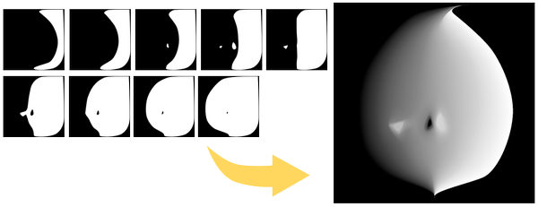
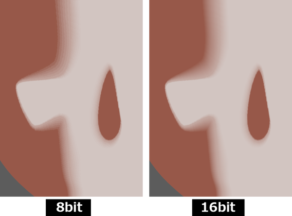
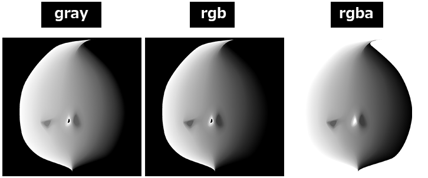
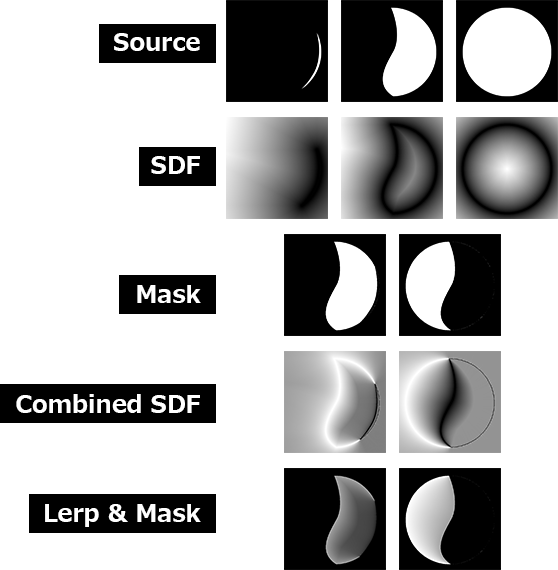
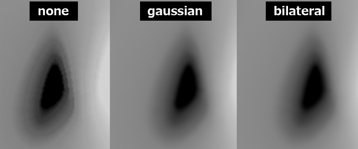
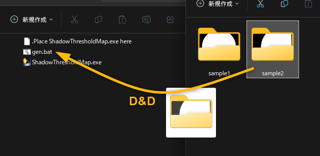

SDF（Signed Distance Field）による補間で**Shadow Threshold Map**を生成します。  

  

アルゴリズムは以下のリンクを参考にしています:  
🔗[SDF Based Transition Blending for Shadow Threshold Map - ながむしメモ](https://nagakagachi.hatenablog.com/entry/2024/03/02/140704)  

> **動作確認環境**
> - Windows 11
> - Python 3.10.9
> - numpy 2.0.0
> - opencv-python 4.10.0.84

## 導入
※[Releases](https://github.com/akasaki1211/sdf_shadow_threshold_map/releases)からexeを使用する場合、このステップは不要です。詳細は[こちら](#exeの使用)をご覧ください。
```
python -m venv venv
venv\scripts\activate
pip install numpy opencv-python
```

**基本 :**  
`-i` オプションで、画像ファイルのみが含まれたディレクトリを指定してください。ディレクトリ内の画像は昇順ソートされます。  
```powershell
python run.py -i 'sample/sample1'
```

**追加オプション :**  
いくつかの追加オプションを使用して実行することもできます。  
```powershell
python run.py -i 'sample/sample2' -o 'output2' -n 'face_map' -b 16 -c "rgb" -r -t
```

## オプション
- `-i`, `--inputdir` : 画像のみが含まれた入力ディレクトリのパスを指定します。必須オプションです。
- `-o`, `--outputdir` : 出力画像を保存するディレクトリパスを指定します。デフォルトは 'output' です。
- `-n`, `--outputname` : 出力されるPNGの名前を指定します。デフォルトは 'shadow_threshold_map' です。
- `-b`, `--bitdepth` : 出力PNGファイルのビット深度を設定します。8または16が有効です。デフォルトは8です。
- `-c`, `--colormode`, 出力画像のカラーモードを選択します。'gray', 'rgb', 'rgba' のどれかを指定します。デフォルトは 'gray' です。
- `-r`, `--reverse` : このオプションをつけるとグラデーションの方向が反転します。  
- `-t`, `--savetemp` : このオプションをつけると処理中の中間画像を保存します。  
- `-f`, `--filtermode` : フィルターモードを選択します。'none'（フィルタなし）、 'gaussian'（ガウスブラー）、'bilateral'（バイラテラルフィルタ）の中から選べます。デフォルトは 'none' です。  
- `-k`, `--kernel_size` : ガウスブラーのカーネルサイズです。奇数である必要があります。デフォルトは3です。
- `-d`, `--diameter` : バイラテラルフィルタの強度です。デフォルトは3です。  

### `--bitdepth`
16bit画像は8bit画像よりもシャドウの境界が滑らかになります。ただし、ファイルサイズと処理負荷が大きくなることに注意してください。  



### `--colormode`
カラーモードが 'rgb' に設定されている場合、グレースケール画像が3チャンネルに複製されます。カラーモードが 'rgba' に設定されている場合、遷移領域がアルファチャンネルに追加されます。  



### `--reverse`
グラデーションの方向を反転します。  


### `--savetemp`
処理中に作成された中間画像を `outputdir\temp` に保存します。デバッグ用途です。  

- step 1 : 入力画像から得られたSDF画像
- step 2 : 入力画像のペアから作成されたマスク
- step 3 : SDF画像のペアから得られたグラデーション
- step 4 : グラデーションでLerpし、マスクで切り抜いた画像



### `--filtermode`
生成された画像にブラーを適用できます。利用可能なオプションは**ガウスブラー**と**バイラテラルフィルタ**です。ガウスブラーは `--kernel_size` と一緒に使用し、バイラテラルフィルタは `--diameter` と一緒に使用します。これらの値が大きいほど、ぼかしが強くなります。  

```powershell
python run.py -i "sample/sample1" -f "gaussian" -k 5
python run.py -i "sample/sample1" -f "bilateral" -d 5
```



## exeの使用
Pythonがインストールされていない環境では、exeを使用できます。[Releases](https://github.com/akasaki1211/sdf_shadow_threshold_map/releases)からダウンロードしてください。  

```powershell
ShadowThresholdMap.exe -i 'sample/sample1'
```

```powershell
ShadowThresholdMap.exe -i 'sample/sample2' -o 'output2' -n 'face_map' -b 16 -c "rgb" -r -t
```

### bat
[`bat`](bat)フォルダにある[`gen.bat`](bat/gen.bat)を使うと上記のコマンドを簡単に使用できます。  
[Releases](https://github.com/akasaki1211/sdf_shadow_threshold_map/releases)からダウンロードした`ShadowThresholdMap.exe`を`bat`フォルダ内に配置し、ソース画像が入ったフォルダを`gen.bat`上にドラッグ＆ドロップしてください。  



`gen.bat` には最小限のコマンド引数が書いてあります。オプションは適宜書き換えて使用してください。  

```batchfile
@echo off

if "%~1"=="" exit

:: show version
echo Using version:
%~dp0ShadowThresholdMap.exe -v

:: run
%~dp0ShadowThresholdMap.exe -i %~1

:: (例) オプション追加
::%~dp0ShadowThresholdMap.exe -i %~1 -b 16 -r -n "face_shadow_map" -c "rgba" -f "gaussian" -k 3
```

## Reference Links
- [SDF Based Transition Blending for Shadow Threshold Map - ながむしメモ](https://nagakagachi.hatenablog.com/entry/2024/03/02/140704)
- [UE5 SDF Face Shadowマッピングでアニメ顔用の影を作ろう - Let's Enjoy Unreal Engine](https://unrealengine.hatenablog.com/entry/2024/02/28/222220)
- [Get \*PERFECT\* Anime Face Shadows (Easier Way) in Blender - YouTube](https://www.youtube.com/watch?v=x-K6bCAl6Qs)
- [GDC Vault - 3D Toon Rendering in 'Hi-Fi RUSH'](https://gdcvault.com/play/1034330/3D-Toon-Rendering-in-Hi)